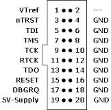

# Introduction

# Pin connection

Fig. Jlink-JTAG pinout

| Function      | Pin - Description | Pin - Connect with |
|:------------- |:-----------------:|:-------------------:
| SWCLK         | PA14              |JTAG - TCK          |
| SWDIO         | PA13              |JTAG - TMS          |
|               |                   |                    |
| UART1-RXD     | PA10              |HC05                |
| UART1-TXD     | PA9               |HC05                |

# Read more
+ Fanled firmware's [README.md](.\Keil_Prj\README.md)
